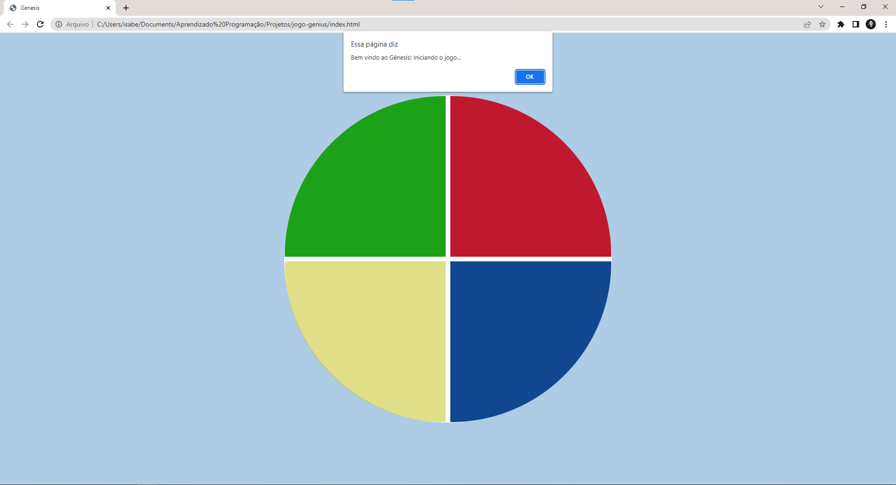

# Jogo Genius
Projeto desenvolvido na plataforma DIO, com a finalidade de estudar HTML, CSS e Javascript.

Clique <a href="https://github.com/isabellacpmelo/jogo-genius.git">aqui</a> para acessar o projeto.

<a href="https://github.com/isabellacpmelo/jogo-genius.git"> 

## Ferramentas utilizadas:
* HTML5
* CSS3
* Javascript

## Print do Projeto
  
### Página do jogo

